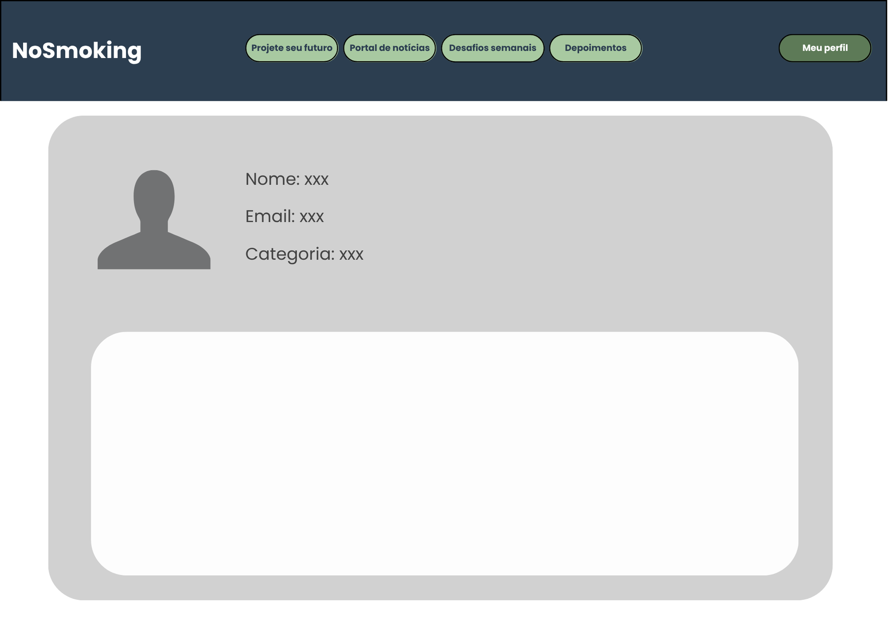

# Introdução

Informações básicas do projeto.

* **Projeto:** [Aumento do Tabagismo]
* **Repositório GitHub:** [[LINK PARA O REPOSITÓRIO NO GITHUB](https://github.com/ICEI-PUC-Minas-PPLCC-TI/atividade-01-aumento-do-tabagismo)]
* **Membros da equipe:**

  * [Samuel Buitrago Silva Andrade](https://github.com/Xum0506) 
  * [LUANA FERREIRA MARQUES](https://github.com/luana-git) 
  * [MANUELA EDMUNDO MOSS](https://github.com/manuelaedmundomoss) 
  * [DANIELA CAROLINA FREITAS PINHEIRO](https://github.com/Dandamcfp) 
  * [MARCELA DEIRÓ ANDRADE](https://github.com/Marcela-06) 

A documentação do projeto é estruturada da seguinte forma:

1. Introdução
2. Contexto
3. Product Discovery
4. Product Design
5. Metodologia
6. Solução
7. Referências Bibliográficas

✅ [Documentação de Design Thinking (MIRO)](files/Etapa03_Artefatos%20do%20Processo%20de%20DesignThinking_GrupoAumentoDoTabagismo.pdf)

# Contexto

O tabagismo é uma condição crônica e altamente dependente, reconhecida como uma das principais causas evitáveis de morte no mundo. De acordo com a Organização Mundial da Saúde (2021), mais de 8 milhões de pessoas morrem todos os anos em decorrência do consumo de tabaco, sendo 1,2 milhão dessas mortes atribuídas à exposição ao fumo passivo. No Brasil, embora as políticas públicas tenham conseguido reduzir consideravelmente o número de fumantes nas últimas décadas, o tabagismo ainda permanece como um problema de saúde pública, afetando diversas faixas etárias, incluindo jovens, adultos e idosos.

## Problema

O aumento do tabagismo é um problema de saúde pública que preocupa especialistas em diversas partes do mundo. Os impactos do tabagismo são graves e afetam tanto os fumantes quanto as pessoas expostas à fumaça do cigarro, o consumo de tabaco está diretamente ligado a diversas doenças respiratórias cardiovasculares e ao câncer, além de gerar dependência química devido à nicotina. Há também consequências sociais e econômicas, como o aumento dos custos com tratamentos médicos e a perda de produtividade no trabalho.

## Objetivos

O presente projeto tem como objetivo desenvolver uma plataforma digital — um website responsivo e interativo — voltado à conscientização, prevenção e combate ao tabagismo, contemplando diferentes perfis de usuários.

## Justificativa

Apesar das conquistas obtidas com as políticas antitabagistas, o Brasil ainda contabiliza cerca de 10% da população adulta como fumante (Vigitel, 2021). Esse número, somado ao aumento do uso de DEFs entre os mais jovens, reforça a urgência por novas estratégias de enfrentamento.

## Público-Alvo

O projeto tem como objetivo principal auxiliar fumantes de todas as idades e estilos de vida abrangendo um público amplo devido à versatilidade do tabaco e à facilidade de adesão ao hábito. Para fins de análise, o público-alvo pode ser segmentado em duas faixas etárias principais: jovens fumantes e fumantes seniors.

# Product Discovery
Durante a fase de descoberta do projeto, aplicamos técnicas do Design Thinking para compreender profundamente o contexto e os públicos afetados pelo aumento do tabagismo. Através de entrevistas qualitativas com fumantes, ex-fumantes e profissionais da saúde, identificamos dores, motivações e obstáculos no processo de cessação. Foram elaboradas personas, mapas de empatia e matriz CSD (Certezas, Suposições, Dúvidas), além do mapeamento de stakeholders e um mural de possibilidades com ideias de solução.
Essas abordagens nos permitiram validar necessidades reais, evidenciar os gatilhos emocionais e sociais ligados ao vício e identificar oportunidades para criar uma solução digital personalizada, acolhedora e eficaz. A descoberta guiou a priorização de funcionalidades com alto impacto e alinhamento aos objetivos estratégicos do projeto.

## Etapa de Entendimento

✅ [Documentação de Design Thinking (MIRO)](files/Etapa03_Artefatos%20do%20Processo%20de%20DesignThinking_GrupoAumentoDoTabagismo.pdf)

## Etapa de Definição
✅ [Documentação de Design Thinking (MIRO)](files/Etapa03_Artefatos%20do%20Processo%20de%20DesignThinking_GrupoAumentoDoTabagismo.pdf)

### Personas

**✳️✳️✳️ APRESENTE OS DIAGRAMAS DE PERSONAS ✳️✳️✳️**
✅ [Documentação de Design Thinking (MIRO)](files/Etapa03_Artefatos%20do%20Processo%20de%20DesignThinking_GrupoAumentoDoTabagismo.pdf)

1. Marcela Souza – Fumante (18 anos)
- Perfil: Estudante de Publicidade e Propaganda, ansiosa, sociável e conectada a tendências digitais.
- Objetivos: Quer entender os malefícios do cigarro eletrônico, mas não pensa em parar de fumar.
- Dores: Dificuldade em manter uma rotina saudável, falta de incentivo para abandonar o cigarro.
- Ganhos buscados: Informações rápidas, visuais e interativas; espaço para desabafar e sentir-se acolhida.
- Ambientes de uso: Fuma em festas e no intervalo das aulas. Usa TikTok, Twitter, Spotify e celular com frequência.
- Proposta de valor: Plataforma leve e interativa que ofereça incentivo emocional, conteúdos em formato de quiz, monitoramento do uso do cigarro e melhora acadêmica e emocional.

2. João Henrique – Fumante (38 anos)
- Perfil: Engenheiro civil, esforçado no trabalho, evita mudanças drásticas, quer reduzir o cigarro gradualmente.
- Objetivos: Reduzir o consumo sem abandonar completamente. Prefere soluções discretas e flexíveis.
- Dores: Procrastinação em decisões pessoais, estresse elevado e dificuldades para dormir.
- Ganhos buscados: Mais produtividade, melhor sono e saúde. Quer controlar o estresse sem cigarro.
- Ambientes de uso: Fuma no carro, no trabalho e em casa. Usa WhatsApp e Instagram.
- Proposta de valor: Abordagem gradual com desafios leves, conteúdos visuais, apoio profissional e reconhecimento do progresso.

3. Ricardo Almeida – Ex-fumante (50 anos)
- Perfil: Gerente de empresa, disciplinado, busca novos desafios. Fumou por muitos anos.
- Objetivos: Deseja ajudar quem quer parar de fumar, quer ser uma referência positiva.
- Dores: Sente falta de espaço para compartilhar sua jornada e se conectar com quem enfrenta o vício.
- Ganhos buscados: Sentir-se útil e valorizado ajudando outros. Conectar-se com novos ex-fumantes.
- Ambientes de uso: Costumava fumar no carro. Hoje, utiliza LinkedIn, podcasts e apps esportivos.
- Proposta de valor: Espaço para atuar como mentor, área de depoimentos e sistema de conquistas com propósito social.

4. Vanessa Oliveira – Ex-fumante (25 anos)
- Perfil: Designer freelancer, introspectiva e criativa. Busca equilíbrio e bem-estar.
- Objetivos: Manter-se livre do cigarro sem afetar sua criatividade e qualidade de vida.
- Dores: Lida com recaídas provocadas por bloqueios criativos ou rotina desequilibrada.
- Ganhos buscados: Vida mais saudável, reconhecimento pelo progresso, mecanismos de recompensa.
- Ambientes de uso: Fumava após o café ou durante criação artística. Usa YouTube e apps de meditação.
- Proposta de valor: Atividades que estimulem a criatividade, botão de pânico, desafios saudáveis e espaço de acolhimento.

5. Dr. Gustavo Martins – Profissional da saúde (57 anos)
- Perfil: Pneumologista, direto e focado. Interessado em ações de prevenção e educação.
- Objetivos: Divulgar informações científicas sobre os danos do cigarro e apoiar o tratamento.
- Dores: Falta de tempo e dificuldade de atingir muitos pacientes de maneira efetiva.
- Ganhos buscados: Ferramenta confiável, acessível, com conteúdo validado e educativo.
- Ambientes de uso: Atua em consultórios, hospitais e palestras. Usa Google Scholar e WhatsApp.
- Proposta de valor: Divulgação de vídeos/artigos, infográficos, ferramenta de interação com pacientes.

6. Camila Nogueira – Profissional da saúde (30 anos)
- Perfil: Psicóloga empática e comunicativa. Trabalha com escuta ativa e grupos de apoio.
- Objetivos: Ajudar pacientes a entender o tabagismo como sintoma emocional. Quer acompanhar jornadas individuais.
- Dores: Frustração com recaídas, falta de reconhecimento e escassez de ferramentas de acompanhamento coletivo.
- Ganhos buscados: Maior impacto com uma plataforma que permita contato frequente e suporte personalizado.
- Ambientes de uso: Atende online e presencial. Usa Instagram e Trello.
- Proposta de valor: Área coletiva de troca, depoimentos reais, interface humanizada e canal para acompanhar pacientes.

Essas personas representam os principais atores impactados ou impactantes na solução almejada. Cada uma traz características e necessidades específicas que guiaram o design de funcionalidades personalizadas para tornar a plataforma mais acolhedora, eficiente e transformadora.

# Product Design

Nesse momento, vamos transformar os insights e validações obtidos em soluções tangíveis e utilizáveis. Essa fase envolve a definição de uma proposta de valor, detalhando a prioridade de cada ideia e a consequente criação de wireframes, mockups e protótipos de alta fidelidade, que detalham a interface e a experiência do usuário.

## Histórias de Usuários

| EU COMO...`PERSONA`           | QUERO/PRECISO ...`FUNCIONALIDADE`                                           | PARA ...`MOTIVO/VALOR`                                                                 |
|------------------------------|------------------------------------------------------------------------------|----------------------------------------------------------------------------------------|
| Fumante                      | Anotar meus sentimentos em um diário pessoal                                 | Me conhecer melhor e entender meus gatilhos                                           |
| Fumante                      | Visualizar há quanto tempo estou sem fumar                                   | Me sentir orgulhoso(a) do meu progresso                                               |
| Fumante                      | Participar de desafios semanais                                              | Ganhar pontos e me manter motivado(a)                                                 |
| Fumante                      | Ver quanto estou economizando ao parar de fumar                              | Ter uma noção concreta do impacto financeiro positivo                                 |
| Fumante                      | Acionar um botão de pânico em momentos de ansiedade                          | Evitar recaídas e aliviar sintomas por meio de jogos e meditações                     |
| Ex-fumante                   | Compartilhar meu depoimento com outros usuários                              | Inspirar e incentivar quem ainda está na luta contra o vício                          |
| Profissional da Saúde        | Criar artigos e notícias informativas sobre o tabagismo                      | Ajudar a conscientizar usuários sobre os perigos do cigarro                           |
| Profissional da Saúde        | Deletar artigos e notícias desatualizadas                                    | Manter o portal com conteúdo confiável e relevante                                    |
| Profissional da Saúde        | Ser ranqueado conforme a relevância dos conteúdos publicados                 | Ser reconhecido e estimular a produção de informação útil para os usuários            |

## Proposta de Valor

**✳️✳️✳️ APRESENTE O DIAGRAMA DA PROPOSTA DE VALOR PARA CADA PERSONA ✳️✳️✳️**

##### Proposta para Persona XPTO ⚠️ EXEMPLO ⚠️
[Propostas de valor]
( Ex-Fumantes:
  docs/images/propostaValorEF.png 
  docs/images/propostaValorEF1.png

  Profissionais da Saúde:
  docs/images/propostaValorPS.png
  docs/images/propostaValorPS1.png

  Fumantes:
  docs/images/propostaValorF.png
  docs/images/propostaValorF1.png
)

## Requisitos

### Requisitos Funcionais

| ID     | Descrição do Requisito                                                                 | Prioridade |
|--------|------------------------------------------------------------------------------------------|------------|
| RF-001 | Permitir que fumantes registrem entradas em um diário pessoal                          | ALTA       |
| RF-002 | Exibir tempo sem fumar de forma dinâmica e personalizada                               | ALTA       |
| RF-003 | Permitir o acionamento do botão de pânico, redirecionando o usuário a conteúdos de apoio | ALTA       |
| RF-004 | Calcular e exibir a economia financeira estimada do usuário                             | MÉDIA      |
| RF-005 | Oferecer desafios semanais que atribuem pontos aos usuários                             | ALTA       |
| RF-006 | Distribuir selos de conquista com base na pontuação acumulada                           | ALTA       |
| RF-007 | Listar e exibir depoimentos de ex-fumantes                                              | MÉDIA      |
| RF-008 | Permitir que profissionais da saúde criem artigos e notícias                            | ALTA       |
| RF-009 | Permitir que profissionais da saúde removam conteúdos informativos                      | MÉDIA      |
| RF-010 | Exibir um ranking público com os profissionais da saúde com base em engajamento         | MÉDIA      |

### Requisitos Não Funcionais

| ID      | Descrição do Requisito                                                                 | Prioridade |
|---------|------------------------------------------------------------------------------------------|------------|
| RNF-001 | O sistema deve ser responsivo e funcionar bem em dispositivos móveis                    | ALTA       |
| RNF-002 | Deve garantir que o tempo de resposta das ações do usuário não ultrapasse 3 segundos     | MÉDIA      |
| RNF-003 | As informações do diário e pontuação devem ser armazenadas localmente e de forma segura | ALTA       |
| RNF-004 | O site deve estar disponível 24/7 com tempo de inatividade mínimo                       | BAIXA      |
| RNF-005 | A plataforma deve seguir diretrizes de acessibilidade (ex: contraste e leitura por voz) | MÉDIA      |

### Wireframes

Estes são os protótipos de telas do sistema.

##### TELA CADASTRO DO LOGIN
Tela com campos para que o usuário crie sua conta na plataforma. Inclui entradas para nome completo, e-mail, categoria(Fumante, Ex-fumante e Profissional da Saúde) e a senha.

##### TELA DE LOGIN
Apresenta campos para e-mail/usuário e senha, acompanhados por um botão de “Entrar”. Há também opções de cadastro ou recuperação de senha. O layout segue um estilo direto e funcional, priorizando a entrada rápida no sistema.

##### TELA DA PÁGINA INICIAL
Tela de boas-vindas do sistema após o login. Mostra o nome do usuário e oferece acessos diretos a funcionalidades principais como:
- Diário
- Projete seu Futuro
- Portal de Notícias
- Depoimentos
- Ranking
- Meu Perfil
Os botões são grandes, de fácil visualização, com ícones e textos explicativos. A organização em grid facilita o uso tanto em celular quanto desktop.

##### TELA DA PÁGINA PROJETE SEU FUTURO
Permite ao usuário visualizar projeções de saúde e finanças com base em seu histórico de consumo de cigarro. A tela mostra comparativos gráficos entre “se continuar fumando” e “se parar agora”, com dados como anos de vida ganhos, dinheiro economizado e qualidade de vida.

##### TELA DA PÁGINA DE PORTAL DE NOTICIAS
Feed de notícias atualizadas sobre saúde, combate ao tabagismo, avanços médicos e dicas para parar de fumar. Cada notícia é exibida em cards com imagem, título e resumo, e há um botão para ler mais.

##### TELA DA PÁGINA DE DEPOIMENTOS
Mural onde usuários podem ler e publicar depoimentos pessoais sobre o processo de parar de fumar. A tela mostra mensagens com nome (ou anônimo), data e conteúdo, além de um botão claro de “Adicionar novo depoimento”. Incentiva a comunidade a se apoiar mutuamente.

##### TELA DA PÁGINA DE RANKING
Lista de profissionais da saúde destacados com base em avaliações dos usuários. Cada card exibe: foto do profissional, nome e especialidade,estrelas de avaliação média, número de avaliações,botões de “Avaliar” e “Entrar em Contato”.
É uma área que valoriza os profissionais mais ativos e bem avaliados da plataforma.

##### TELA DA PÁGINA DE PERFIL
Tela onde o usuário acessa seus dados pessoais e outras informações relevantes. Contém opções como:
- Editar perfil
- Sair da conta

### Canva

### Protótipo Interativo

✅ [Protótipo Interativo (Figma)](https://www.figma.com/proto/kTNMt5dOtkWXqeDPfMp1ox/Prot%C3%B3tipo-do-site?node-id=1-703&p=f&t=mFD1EDdYp9qCcQrC-1&scaling=scale-down&content-scaling=fixed&page-id=0%3A1&starting-point-node-id=1%3A902&show-proto-sidebar=1)

# Metodologia

A organização do grupo foi baseada na divisão de responsabilidades por funcionalidades específicas do sistema, com uso de ferramentas de planejamento colaborativo para garantir a eficiência no desenvolvimento do projeto. O grupo foi composto por cinco integrantes, e a distribuição das tarefas foi feita da seguinte forma:
- Marcela foi responsável pela implementação das páginas de login, cadastro de usuário e pela funcionalidade da “plantinha” que cresce conforme o usuário permanece sem fumar, além de realizar a publicação do site na web.
- Luana desenvolveu a funcionalidade do Diário do Fumante, o Ranking de Profissionais da Saúde, o cabeçalho principal do site e a responsividade dele.
- Samuel criou as páginas “Projete seu Futuro” e “Depoimentos”, focando nas motivações e histórias dos usuários.
- Manuela ficou encarregada da página de notícias e dos desafios semanais, além de atuar no design geral da interface.
- Daniela implementou o botão de urgência, destinado a momentos de recaída, e a lógica do sistema de pontuação que estimula o abandono do cigarro.
A metodologia de trabalho adotada foi baseada no Kanban, com apoio de reuniões regulares para atualização do progresso e definição das próximas etapas. As tarefas foram organizadas por funcionalidades, garantindo que cada integrante atuasse de forma autônoma, mas integrada ao todo do projeto.

Para o desenvolvimento do projeto, foram utilizadas as seguintes ferramentas:
- Figma, Canva e Miro: utilizadas para o design, prototipação e organização visual do projeto.
- HTML, CSS e JavaScript: tecnologias base para o desenvolvimento front-end do site.
- JSON Server: utilizado para simular uma API e armazenar dados como usuários, depoimentos, pontuação, entre outros.
- Visual Studio Code (VS Code): editor de código utilizado por toda a equipe.
- GitHub: utilizados para versionamento do código e colaboração entre os membros do grupo.
- Vercel: plataforma empregada para a hospedagem do site de forma gratuita e acessível.
Esse conjunto de práticas e ferramentas garantiu um processo de desenvolvimento colaborativo, organizado e orientado à entrega de uma solução funcional, interativa e acessível.

## Ferramentas

Relação de ferramentas empregadas pelo grupo durante o projeto.

| Ambiente                    | Plataforma | Link de acesso                                     |
| --------------------------- | ---------- | -------------------------------------------------- |
| Processo de Design Thinking | Miro       | https://miro.com/welcomeonboard/dURjWTdvbk01cEJRdlBSTDRGRm1EVWxpUlY1a2k2ZEkvWTN3bVBkb2t3eCtjMlkxMTBnbm1ZTTFqd3g5aHJ4c3NJMU1wcm01ODhFQTdyaEVLSlNUczk2UTJJdE9HMy9jNytuWkZPRVpuVklVQ2F4d1dmc0pQMElYbkQ4b29ZSDNQdGo1ZEV3bUdPQWRZUHQzSGl6V2NBPT0hdjE=?share_link_id=661228107676        |
| Repositório de código     | GitHub     | https://github.com/ICEI-PUC-Minas-PPLCC-TI/atividade-01-aumento-do-tabagismo.git      |
| Hospedagem do site          | Render     | https://site.render.com/XXXXXXX ⚠️ EXEMPLO ⚠️ |
| Protótipo Interativo       | Figma      | https://www.figma.com/proto/kTNMt5dOtkWXqeDPfMp1ox/Prot%C3%B3tipo-do-site?node-id=1-703&p=f&t=mFD1EDdYp9qCcQrC-1&scaling=scale-down&content-scaling=fixed&page-id=0%3A1&starting-point-node-id=1%3A902&show-proto-sidebar=1   |
|                             |            |                                                    |

## Gerenciamento do Projeto

O desenvolvimento do nosso trabalho seguiu um processo estruturado em etapas bem definidas, tendo como ponto de partida a abordagem do Design Thinking. Ao longo de várias semanas, o grupo se reuniu de forma colaborativa para compreender a problemática, identificar as necessidades do público-alvo e propor soluções viáveis. Esse processo envolveu a produção de diversos documentos fundamentais, organizados nas seguintes fases:

1. Entender – Empatia
Nesta etapa inicial, buscamos compreender melhor a problemática e os envolvidos. Para isso, construímos a Matriz CSD (Certezas, Suposições e Dúvidas), o Mapa de Stakeholders, realizamos Entrevistas Qualitativas com usuários reais e extraímos os principais Insights e Highlights. Esses materiais nos ajudaram a entender com mais profundidade o público-alvo, suas experiências e suas necessidades.

2. Entender – Definição
Com base nos dados da etapa anterior, identificamos as personas do projeto e mapeamos suas dores e ganhos por meio da Proposta de Valor e do Perfil do Cliente. Essa etapa foi essencial para direcionar as soluções de forma mais precisa e centrada no usuário.

3. Explorar
Nessa fase, aprofundamos o contexto da problemática sob a ótica das personas, criando Histórias de Usuários que guiaram a geração de ideias. A partir de sessões de Brainstorming, levantamos possíveis produtos e serviços e, com base em critérios de viabilidade e impacto, selecionamos as ideias mais promissoras. Em seguida, desenvolvemos os Mapas de Valor, o Mapa de Priorização e o Mapa Conceitual para organizar as soluções.

4. Materializar
Com as ideias priorizadas, iniciamos a fase de prototipação. Desenvolvemos Wireframes, Fluxos do Usuário e Storyboards utilizando a plataforma Figma, o que permitiu simular a experiência do usuário final. A partir desses protótipos, demos início à programação do software.

Desenvolvimento do Site
A implementação técnica foi organizada em duas sprints, nas quais cada integrante do grupo foi responsável por desenvolver uma funcionalidade específica da plataforma. Ao final da Sprint 2, o grupo entregou um site dinâmico, interativo e multifuncional, contendo diversas soluções integradas que serão detalhadas nas próximas seções deste documento.

# Solução Implementada

Esta seção apresenta todos os detalhes da solução criada no projeto.

## Vídeo do Projeto

O vídeo a seguir traz uma apresentação do problema que a equipe está tratando e a proposta de solução. 

## Funcionalidades
Esta seção apresenta as funcionalidades da solução.

##### SPRINT 01
##### Funcionalidade 1 - Tempo sem fumar e planta do progresso
Mostra, em tempo real, há quanto tempo o usuário está sem fumar. Exibe uma planta que cresce conforme o usuário fica sem fumar.
* **Tela da funcionalidade**: 

##### Funcionalidade 2 - Botão do pânico
O objetivo desta funcionalidade é proporcionar um recurso de acesso rápido para usuários fumantes. Ao pressionar o botão, o usuário terá à disposição uma variedade de jogos e atividades que contribuirão para sua distração e o auxiliarão a lidar com momentos de crise de abstinência de forma mais leve e suportável.
* **Tela da funcionalidade**: 

##### Funcionalidade 3 - Portal de notícias
Portal de notícias interativo focado em temas relacionados à saúde pública e combate ao tabagismo. Os usuários cadastrados como profissionais da área da saúde podem adicionar e excluir notícias diretamente pela interface. O conteúdo pode ser filtrado por ano, assunto, país e fonte, além de ser ordenado por data ou popularidade. Cada notícia possui uma página de detalhes com contagem de visualizações e ações rápidas.
* **Tela da funcionalidade**: 

##### Funcionalidade 4 - Projeção do futuro
O usuário deve inserir um conjunto de informações. Com base nelas o sistema deve calcular, quanto o fumante já deixou de gastar com cigarro e suas expectativas de melhora de saúde.
* **Tela da funcionalidade**: 

##### Funcionalidade 5 - Diário do fumante
Um espaço pessoal onde o usuário pode registrar diariamente sua jornada para parar de fumar.
* **Tela da funcionalidade**: 

##### SPRINT 02
##### Funcionalidade 6 - Cadastros de fumantes, ex-fumantes e profissionais da saúde
Cadastra e cria o perfil do usuário, filtrando quais funcionalidades vão estar disponíveis de acordo com a categoria do usuário (fumante, ex-fumante ou profissional da área da saúde).
* **Tela da funcionalidade**: 

##### Funcionalidade 7 - Depoimentos dos ex-fumantes
Permite ao usuário compartilhar depoimentos relacionados ao cigarro.
* **Tela da funcionalidade**: 

##### Funcionalidade 8 - Desafios semanais
Funcionalidade dinâmica que apresenta ao usuário um desafio diferente a cada semana, com a opção de marcar como concluído ou não. Ao clicar em “Enviar desafio”, um modal exibe uma mensagem personalizada. Os desafios são rotativos e definidos com base na semana do ano.
* **Tela da funcionalidade**: 

##### Funcionalidade 9 - Sistema de pontos e recompensas
Permite que o usuário acumule pontos a cada desafio completo, conquistando níveis e medalhas.
* **Tela da funcionalidade**: 

##### Funcionalidade 10 - Ranking dos profissionais da saúde 
Um espaço dedicado para destacar os profissionais da saúde que mais se destacam, com base nas avaliações da
comunidade.
* **Tela da funcionalidade**: 

## Estrutura de Dados - Usuários

Registro dos usuários do sistema, utilizados para login e para exibição de informações no perfil.

json
{
  "id": "eed55b91-45be-4f2c-81bc-7686135503f9",
  "nome": "Administrador do Sistema",
  "email": "admin@abc.com",
  "login": "admin",
  "senha": "123",
  "categoria": "ex-fumante",
  "precoPorMaco": 12,
  "cigarrosPorMaco": 20,
  "dataDeParada": "2024-06-01T00:00:00.000Z",
  "pontos": 50,
  "selos": [],
  "telefone": "(11) 98765-4321",
  "logado": true
}

## Módulos e APIs

*Images*:

* Unsplash - [https://unsplash.com/](https://unsplash.com/) 

*Fonts:*

* Font Awesome - [https://fontawesome.com/](https://fontawesome.com/)

*Scripts:*

* jQuery - [http://www.jquery.com/](http://www.jquery.com/) 
* Bootstrap 5 - [https://getbootstrap.com/](https://getbootstrap.com/)

*Orientações*:

- [Formato ABNT](https://www.normastecnicas.com/abnt/trabalhos-academicos/referencias/)
- [Referências Bibliográficas da ABNT](https://comunidade.rockcontent.com/referencia-bibliografica-abnt/)